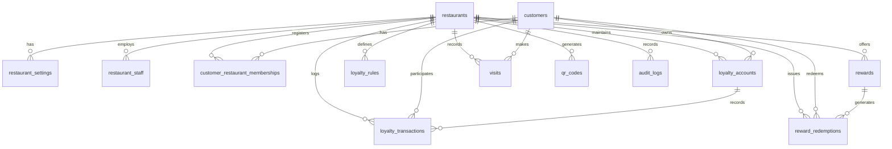

# Database Architecture & Schema Specification

This document details the multi-tenant PostgreSQL database architecture for the Digital Loyalty Platform, designed for Supabase PostgreSQL with strict Row Level Security (RLS), append-only auditable ledger invariants, and atomic state-machine driven reward redemption.

---

## 1. Architectural Core Principles

1. **Strict Multi-Tenancy**: Every entity belongs to a restaurant via `restaurant_id UUID NOT NULL REFERENCES restaurants(id) ON DELETE CASCADE`.
2. **Auditable Append-Only Ledger**: Loyalty balances are never directly updated from user input. Every change in points or stamps is recorded in `loyalty_transactions` with a cryptographic balance trail and immutable audit metadata. Modification and deletion on `loyalty_transactions` are prohibited by PostgreSQL triggers.
3. **Dual Loyalty Engine**: Supports both **Points-based** (`POINTS`) and **Visit/Stamp-based** (`STAMPS`) models per restaurant.
4. **Atomic Concurrency Protection**: Reward redemption issuance and in-store fulfillment execute through PostgreSQL `SECURITY DEFINER` stored procedures utilizing `SELECT ... FOR UPDATE` row locks to prevent race conditions and double-spending.
5. **Defense-in-Depth RLS**: Row Level Security is enabled and enforced across all tables, ensuring strict tenant data separation, customer profile isolation, and role-based staff privilege separation.

---

## 2. Entity-Relationship Overview

---

## 3. Table Catalog & Constraint Specifications

### 1. `restaurants` (Tenants)
The root tenant record for each restaurant/cafe.

| Column | Type | Constraints | Description |
| :--- | :--- | :--- | :--- |
| `id` | `UUID` | `PRIMARY KEY DEFAULT gen_random_uuid()` | Unique tenant identifier |
| `slug` | `VARCHAR(64)` | `UNIQUE NOT NULL`, `CHECK (slug ~* '^[a-z0-9-]+$')` | URL-friendly slug (e.g., `/r/artisan-coffee`) |
| `name` | `VARCHAR(128)` | `NOT NULL` | Restaurant business display name |
| `tagline` | `VARCHAR(256)` | | Subtitle or marketing slogan |
| `logo_url` | `TEXT` | | Public URL to brand logo |
| `brand_color` | `VARCHAR(16)` | `DEFAULT '#10B981' NOT NULL` | Primary branding hex color |
| `accent_color` | `VARCHAR(16)` | `DEFAULT '#059669' NOT NULL` | Secondary branding hex color |
| `currency` | `VARCHAR(8)` | `DEFAULT 'USD' NOT NULL` | ISO currency code (USD, EUR, GBP, etc.) |
| `is_active` | `BOOLEAN` | `DEFAULT TRUE NOT NULL` | Active status |
| `created_at` | `TIMESTAMPTZ` | `DEFAULT NOW() NOT NULL` | Creation timestamp |
| `updated_at` | `TIMESTAMPTZ` | `DEFAULT NOW() NOT NULL` | Auto-updating timestamp |

*Indexes:*
- `idx_restaurants_slug ON restaurants(slug)`
- `idx_restaurants_active ON restaurants(is_active)`

---

### 2. `restaurant_settings` (Configuration)
Tenant-specific loyalty configuration and operational thresholds.

| Column | Type | Constraints | Description |
| :--- | :--- | :--- | :--- |
| `restaurant_id` | `UUID` | `PRIMARY KEY REFERENCES restaurants(id) ON DELETE CASCADE` | 1-to-1 tenant relation |
| `loyalty_model` | `VARCHAR(16)` | `DEFAULT 'POINTS' NOT NULL`, `CHECK IN ('POINTS', 'STAMPS')` | Engine mode |
| `points_per_currency_unit` | `NUMERIC(10,2)` | `DEFAULT 1.00 NOT NULL`, `CHECK (>= 0)` | Points earned per $1.00 spent |
| `stamps_target_count` | `INT` | `DEFAULT 10 NOT NULL`, `CHECK (> 0)` | Stamps required to complete card |
| `stamp_minimum_spend` | `NUMERIC(10,2)` | `DEFAULT 0.00 NOT NULL`, `CHECK (>= 0)` | Minimum purchase to earn a stamp |
| `reward_expiry_days` | `INT` | `DEFAULT 30 NOT NULL`, `CHECK (> 0)` | Default validity for earned rewards |
| `redemption_code_ttl_minutes`| `INT` | `DEFAULT 15 NOT NULL`, `CHECK (> 0)` | Minutes customer code remains valid |
| `welcome_bonus_points` | `INT` | `DEFAULT 0 NOT NULL`, `CHECK (>= 0)` | Welcome points upon registration |
| `welcome_bonus_stamps` | `INT` | `DEFAULT 0 NOT NULL`, `CHECK (>= 0)` | Welcome stamps upon registration |
| `terms_and_conditions` | `TEXT` | | Legal terms of loyalty program |
| `created_at` | `TIMESTAMPTZ` | `DEFAULT NOW() NOT NULL` | Creation timestamp |
| `updated_at` | `TIMESTAMPTZ` | `DEFAULT NOW() NOT NULL` | Auto-updating timestamp |

---

### 3. `restaurant_staff` (RBAC)
Maps Supabase authentication user records (`auth.users`) to tenant roles.

| Column | Type | Constraints | Description |
| :--- | :--- | :--- | :--- |
| `id` | `UUID` | `PRIMARY KEY DEFAULT gen_random_uuid()` | Staff record ID |
| `restaurant_id` | `UUID` | `NOT NULL REFERENCES restaurants(id) ON DELETE CASCADE` | Associated tenant |
| `user_id` | `UUID` | `NOT NULL` | Supabase `auth.users(id)` |
| `email` | `VARCHAR(255)` | `NOT NULL` | Work email address |
| `full_name` | `VARCHAR(128)` | `NOT NULL` | Staff member full name |
| `role` | `VARCHAR(16)` | `NOT NULL DEFAULT 'STAFF'`, `CHECK IN ('STAFF', 'MANAGER', 'OWNER')` | RBAC Tier |
| `is_active` | `BOOLEAN` | `DEFAULT TRUE NOT NULL` | Employment status |
| `created_at` | `TIMESTAMPTZ` | `DEFAULT NOW() NOT NULL` | Creation timestamp |
| `updated_at` | `TIMESTAMPTZ` | `DEFAULT NOW() NOT NULL` | Auto-updating timestamp |

*Unique Constraints:*
- `uq_staff_restaurant_user UNIQUE (restaurant_id, user_id)`
- `uq_staff_restaurant_email UNIQUE (restaurant_id, email)`

---

### 4. `customers` (Global Identity)
Normalized customer identity across restaurants, keyed primarily by authenticated phone number.

| Column | Type | Constraints | Description |
| :--- | :--- | :--- | :--- |
| `id` | `UUID` | `PRIMARY KEY DEFAULT gen_random_uuid()` | Internal customer ID |
| `user_id` | `UUID` | `UNIQUE` | Supabase `auth.users(id)` upon OTP login |
| `phone` | `VARCHAR(32)` | `UNIQUE NOT NULL`, `CHECK (~* '^\+?[0-9]{7,15}$')` | E.164 normalized phone |
| `email` | `VARCHAR(255)` | | Optional email |
| `full_name` | `VARCHAR(128)` | | Customer display name |
| `birthday` | `DATE` | | Birthday for bonus rewards |
| `created_at` | `TIMESTAMPTZ` | `DEFAULT NOW() NOT NULL` | Registration timestamp |
| `updated_at` | `TIMESTAMPTZ` | `DEFAULT NOW() NOT NULL` | Auto-updating timestamp |

---

### 5. `customer_restaurant_memberships`
Join table connecting customers to individual restaurants.

| Column | Type | Constraints | Description |
| :--- | :--- | :--- | :--- |
| `id` | `UUID` | `PRIMARY KEY DEFAULT gen_random_uuid()` | Membership ID |
| `restaurant_id` | `UUID` | `NOT NULL REFERENCES restaurants(id) ON DELETE CASCADE` | Tenant |
| `customer_id` | `UUID` | `NOT NULL REFERENCES customers(id) ON DELETE CASCADE` | Customer |
| `membership_number` | `VARCHAR(32)` | `NOT NULL` | Human-readable ID (e.g. `M-ART1-0001`) |
| `joined_at` | `TIMESTAMPTZ` | `DEFAULT NOW() NOT NULL` | Join timestamp |
| `last_activity_at` | `TIMESTAMPTZ` | `DEFAULT NOW() NOT NULL` | Last visit / earn / redeem |
| `is_active` | `BOOLEAN` | `DEFAULT TRUE NOT NULL` | Membership status |

*Unique Constraints:*
- `uq_membership_tenant_customer UNIQUE (restaurant_id, customer_id)`
- `uq_membership_tenant_number UNIQUE (restaurant_id, membership_number)`

---

### 6. `loyalty_accounts` (Balance Summary)
Tenant-specific balance cache backed by the ledger.

| Column | Type | Constraints | Description |
| :--- | :--- | :--- | :--- |
| `id` | `UUID` | `PRIMARY KEY DEFAULT gen_random_uuid()` | Account ID |
| `restaurant_id` | `UUID` | `NOT NULL REFERENCES restaurants(id) ON DELETE CASCADE` | Tenant |
| `customer_id` | `UUID` | `NOT NULL REFERENCES customers(id) ON DELETE CASCADE` | Customer |
| `loyalty_model` | `VARCHAR(16)` | `NOT NULL`, `CHECK IN ('POINTS', 'STAMPS')` | Current model |
| `current_balance` | `INT` | `DEFAULT 0 NOT NULL`, `CHECK (current_balance >= 0)` | Available points or stamps |
| `lifetime_accrued`| `INT` | `DEFAULT 0 NOT NULL`, `CHECK (lifetime_accrued >= 0)` | All-time earned |
| `lifetime_redeemed`| `INT` | `DEFAULT 0 NOT NULL`, `CHECK (lifetime_redeemed >= 0)` | All-time redeemed |
| `version` | `INT` | `DEFAULT 1 NOT NULL`, `CHECK (version >= 1)` | Optimistic concurrency version |
| `updated_at` | `TIMESTAMPTZ` | `DEFAULT NOW() NOT NULL` | Last balance modification |

*Unique Constraints:*
- `uq_loyalty_account_tenant_customer UNIQUE (restaurant_id, customer_id)`

---

### 7. `loyalty_transactions` (Append-Only Ledger)
The source-of-truth ledger for all points and stamp adjustments.

| Column | Type | Constraints | Description |
| :--- | :--- | :--- | :--- |
| `id` | `UUID` | `PRIMARY KEY DEFAULT gen_random_uuid()` | Transaction ID |
| `restaurant_id` | `UUID` | `NOT NULL REFERENCES restaurants(id) ON DELETE CASCADE` | Tenant |
| `customer_id` | `UUID` | `NOT NULL REFERENCES customers(id) ON DELETE CASCADE` | Customer |
| `loyalty_account_id`| `UUID` | `NOT NULL REFERENCES loyalty_accounts(id) ON DELETE CASCADE`| Account |
| `type` | `VARCHAR(32)` | `NOT NULL`, `CHECK IN ('VISIT','PURCHASE','BONUS','REFERRAL','BIRTHDAY','MANUAL_ADJUSTMENT','REWARD_REDEMPTION','REVERSAL')` | Transaction classification |
| `points_stamps` | `INT` | `NOT NULL`, `CHECK (points_stamps != 0)` | Positive for credit, negative for debit |
| `balance_after` | `INT` | `NOT NULL`, `CHECK (balance_after >= 0)` | Resulting balance |
| `reference_id` | `VARCHAR(128)` | | External order ID, visit ID, or reward ID |
| `idempotency_key`| `VARCHAR(128)` | | Replay prevention key |
| `description` | `VARCHAR(255)` | `NOT NULL` | Human-readable explanation |
| `source` | `VARCHAR(64)` | `DEFAULT 'APP' NOT NULL` | Channel (`APP`, `STAFF_POS`, `SYSTEM`) |
| `created_by` | `UUID` | | Initiator `auth.users(id)` |
| `audit_metadata` | `JSONB` | `DEFAULT '{}'::jsonb NOT NULL` | Contextual metadata |
| `created_at` | `TIMESTAMPTZ` | `DEFAULT NOW() NOT NULL` | Timestamp |

*Unique Constraints:*
- `uq_trans_tenant_idempotency UNIQUE (restaurant_id, idempotency_key)`

---

### 8. `loyalty_rules`
Configurable bonus triggers and promotional multipliers.

| Column | Type | Constraints | Description |
| :--- | :--- | :--- | :--- |
| `id` | `UUID` | `PRIMARY KEY DEFAULT gen_random_uuid()` | Rule ID |
| `restaurant_id` | `UUID` | `NOT NULL REFERENCES restaurants(id) ON DELETE CASCADE` | Tenant |
| `name` | `VARCHAR(128)` | `NOT NULL` | Rule title |
| `rule_type` | `VARCHAR(32)` | `NOT NULL`, `CHECK IN ('PURCHASE_TIER','VISIT_MILESTONE','BONUS_EVENT','BIRTHDAY')` | Rule logic type |
| `conditions` | `JSONB` | `DEFAULT '{}'::jsonb NOT NULL` | Evaluator parameters |
| `reward_points_stamps` | `INT` | `NOT NULL`, `CHECK (> 0)` | Points or stamps to award |
| `is_active` | `BOOLEAN` | `DEFAULT TRUE NOT NULL` | Active toggle |
| `valid_from` | `TIMESTAMPTZ` | `DEFAULT NOW() NOT NULL` | Start validity |
| `valid_to` | `TIMESTAMPTZ` | `CHECK (valid_to IS NULL OR valid_to > valid_from)` | End validity |
| `created_at` | `TIMESTAMPTZ` | `DEFAULT NOW() NOT NULL` | Creation timestamp |
| `updated_at` | `TIMESTAMPTZ` | `DEFAULT NOW() NOT NULL` | Auto-updating timestamp |

---

### 9. `rewards` (Catalog)
Items redeemable with points or completed stamp cards.

| Column | Type | Constraints | Description |
| :--- | :--- | :--- | :--- |
| `id` | `UUID` | `PRIMARY KEY DEFAULT gen_random_uuid()` | Reward ID |
| `restaurant_id` | `UUID` | `NOT NULL REFERENCES restaurants(id) ON DELETE CASCADE` | Tenant |
| `title` | `VARCHAR(128)` | `NOT NULL` | Item title |
| `description` | `TEXT` | | Item description / fine print |
| `image_url` | `TEXT` | | Photo URL |
| `cost_points_stamps`| `INT` | `NOT NULL`, `CHECK (cost_points_stamps > 0)` | Cost in points or stamps |
| `is_active` | `BOOLEAN` | `DEFAULT TRUE NOT NULL` | Visibility toggle |
| `max_redemptions_per_customer`| `INT` | `CHECK (IS NULL OR > 0)` | Customer limit |
| `total_inventory`| `INT` | `CHECK (IS NULL OR >= 0)` | Total stock available |
| `claimed_inventory`| `INT` | `DEFAULT 0 NOT NULL`, `CHECK (>= 0)` | Number already claimed |
| `valid_from` | `TIMESTAMPTZ` | `DEFAULT NOW() NOT NULL` | Start validity |
| `valid_until` | `TIMESTAMPTZ` | `CHECK (valid_until IS NULL OR valid_until > valid_from)` | Expiry |
| `created_at` | `TIMESTAMPTZ` | `DEFAULT NOW() NOT NULL` | Creation timestamp |
| `updated_at` | `TIMESTAMPTZ` | `DEFAULT NOW() NOT NULL` | Auto-updating timestamp |

---

### 10. `reward_redemptions` (State Machine)
Tracks every reward redemption through its operational lifecycle.

| Column | Type | Constraints | Description |
| :--- | :--- | :--- | :--- |
| `id` | `UUID` | `PRIMARY KEY DEFAULT gen_random_uuid()` | Redemption ID |
| `restaurant_id` | `UUID` | `NOT NULL REFERENCES restaurants(id) ON DELETE CASCADE` | Tenant |
| `customer_id` | `UUID` | `NOT NULL REFERENCES customers(id) ON DELETE CASCADE` | Customer |
| `reward_id` | `UUID` | `NOT NULL REFERENCES rewards(id) ON DELETE RESTRICT` | Claimed Reward |
| `loyalty_transaction_id`| `UUID` | `REFERENCES loyalty_transactions(id) ON DELETE RESTRICT` | Associated debit transaction |
| `code` | `VARCHAR(16)` | `NOT NULL` | Alphanumeric in-store code (`RD-XXXX-XXXX`) |
| `status` | `VARCHAR(16)` | `DEFAULT 'REQUESTED' NOT NULL`, `CHECK IN ('AVAILABLE','REQUESTED','ISSUED','REDEEMED','EXPIRED','CANCELLED')` | Lifecycle state |
| `points_cost` | `INT` | `NOT NULL`, `CHECK (points_cost > 0)` | Deducted points/stamps |
| `idempotency_key`| `VARCHAR(128)`| | Replay token |
| `requested_at` | `TIMESTAMPTZ` | `DEFAULT NOW() NOT NULL` | Request initiated |
| `issued_at` | `TIMESTAMPTZ` | | Code generated |
| `expires_at` | `TIMESTAMPTZ` | `NOT NULL` | Code expiration deadline |
| `redeemed_at` | `TIMESTAMPTZ` | | Staff fulfillment timestamp |
| `redeemed_by_staff_id`| `UUID` | `REFERENCES restaurant_staff(id)` | Fulfilling staff member |
| `cancelled_at` | `TIMESTAMPTZ` | | Cancellation timestamp |
| `cancellation_reason`| `VARCHAR(255)`| | Cancellation reason |
| `created_at` | `TIMESTAMPTZ` | `DEFAULT NOW() NOT NULL` | Record creation |

*Unique Constraints:*
- `uq_redemptions_tenant_code UNIQUE (restaurant_id, code)`
- `uq_redemptions_tenant_idempotency UNIQUE (restaurant_id, idempotency_key)`

---

### 11. `visits`
In-store visit log recorded by staff POS or QR scan.

| Column | Type | Constraints | Description |
| :--- | :--- | :--- | :--- |
| `id` | `UUID` | `PRIMARY KEY DEFAULT gen_random_uuid()` | Visit ID |
| `restaurant_id` | `UUID` | `NOT NULL REFERENCES restaurants(id) ON DELETE CASCADE` | Tenant |
| `customer_id` | `UUID` | `NOT NULL REFERENCES customers(id) ON DELETE CASCADE` | Customer |
| `spend_amount` | `NUMERIC(10,2)`| `DEFAULT 0.00 NOT NULL`, `CHECK (spend_amount >= 0)` | Spend in restaurant currency |
| `points_or_stamp_earned`| `INT` | `DEFAULT 1 NOT NULL`, `CHECK (>= 0)` | Quantity earned |
| `recorded_by_staff_id`| `UUID` | `REFERENCES restaurant_staff(id)` | Authorizing staff |
| `notes` | `VARCHAR(255)` | | Staff notes |
| `created_at` | `TIMESTAMPTZ` | `DEFAULT NOW() NOT NULL` | Timestamp |

---

### 12. `qr_codes`
QR code identifiers and redirection metadata.

| Column | Type | Constraints | Description |
| :--- | :--- | :--- | :--- |
| `id` | `UUID` | `PRIMARY KEY DEFAULT gen_random_uuid()` | QR ID |
| `restaurant_id` | `UUID` | `NOT NULL REFERENCES restaurants(id) ON DELETE CASCADE` | Tenant |
| `label` | `VARCHAR(128)` | `NOT NULL` | Description (`Table 14`, `Register 1`) |
| `code_identifier`| `VARCHAR(64)` | `UNIQUE NOT NULL` | Short alphanumeric identifier |
| `location_tag` | `VARCHAR(64)` | | Location tag for analytics |
| `target_path` | `VARCHAR(255)` | `NOT NULL` | Landing path (`/r/artisan-coffee?loc=table14`) |
| `scan_count` | `INT` | `DEFAULT 0 NOT NULL`, `CHECK (scan_count >= 0)` | Total scans |
| `is_active` | `BOOLEAN` | `DEFAULT TRUE NOT NULL` | Active toggle |
| `created_at` | `TIMESTAMPTZ` | `DEFAULT NOW() NOT NULL` | Creation timestamp |

---

### 13. `audit_logs` (Append-Only)
Security audit log for sensitive operations.

| Column | Type | Constraints | Description |
| :--- | :--- | :--- | :--- |
| `id` | `UUID` | `PRIMARY KEY DEFAULT gen_random_uuid()` | Audit ID |
| `restaurant_id` | `UUID` | `NOT NULL REFERENCES restaurants(id) ON DELETE CASCADE` | Tenant |
| `actor_id` | `UUID` | | User ID of actor |
| `actor_role` | `VARCHAR(32)` | `NOT NULL` | Role (`CUSTOMER`, `STAFF`, `MANAGER`, `OWNER`) |
| `action` | `VARCHAR(64)` | `NOT NULL` | Event (`REWARD_ISSUED`, `REWARD_FULFILLED`) |
| `target_entity`| `VARCHAR(64)` | `NOT NULL` | Affected table |
| `target_id` | `VARCHAR(64)` | | Affected entity ID |
| `ip_address` | `VARCHAR(45)` | | Client IPv4/IPv6 |
| `user_agent` | `TEXT` | | Client user agent |
| `details` | `JSONB` | `DEFAULT '{}'::jsonb NOT NULL` | Contextual payload |
| `created_at` | `TIMESTAMPTZ` | `DEFAULT NOW() NOT NULL` | Timestamp |

---

## 4. Stored Procedures & Business Logic

### `fn_issue_reward_redemption`
- **Security**: `SECURITY DEFINER`
- **Purpose**: Atomically claims a reward for a customer.
- **Workflow**:
  1. Checks idempotency key: if previously issued, returns existing record.
  2. Locks `loyalty_accounts` row with `FOR UPDATE`.
  3. Locks `rewards` row with `FOR UPDATE`.
  4. Verifies reward active status, inventory, validity period, and customer balance sufficiency.
  5. Inserts debit record into `loyalty_transactions` (`points_stamps = -reward.cost`).
  6. Updates cached balance in `loyalty_accounts`.
  7. Increments `claimed_inventory` in `rewards`.
  8. Generates unique single-use code (`RD-XXXX-XXXX`) with configured TTL.
  9. Inserts `reward_redemptions` row in state `ISSUED`.
  10. Writes to `audit_logs`.

### `fn_fulfill_reward_redemption`
- **Security**: `SECURITY DEFINER`
- **Purpose**: In-store staff verification and single-use fulfillment.
- **Workflow**:
  1. Verifies staff identity and membership in the restaurant.
  2. Locks `reward_redemptions` row by code with `FOR UPDATE`.
  3. Enforces state machine: rejects if already `REDEEMED`, `CANCELLED`, or `EXPIRED`.
  4. Updates status to `REDEEMED` with `redeemed_at = NOW()` and `redeemed_by_staff_id`.
  5. Logs fulfillment event in `audit_logs`.
  6. Returns verified receipt payload.

---

## 5. Row Level Security (RLS) Policy Matrix

| Table | SELECT | INSERT | UPDATE | DELETE |
| :--- | :--- | :--- | :--- | :--- |
| `restaurants` | Active OR Staff | System/Admin | Owner | System/Admin |
| `restaurant_settings` | Active OR Staff | System/Admin | Manager / Owner | System/Admin |
| `restaurant_staff` | Staff | Owner | Owner | Owner |
| `customers` | Self OR Staff of member restaurant | Self / System | Self | System/Admin |
| `customer_restaurant_memberships` | Customer OR Staff | Customer OR Staff | Customer OR Mgr/Owner | System/Admin |
| `loyalty_accounts` | Customer OR Staff | Stored Procedure | Stored Procedure | Prohibited |
| `loyalty_transactions` | Customer OR Staff | Stored Procedure | Prohibited (Trigger) | Prohibited (Trigger) |
| `loyalty_rules` | Staff | Manager / Owner | Manager / Owner | Manager / Owner |
| `rewards` | Active (Public) OR Staff | Manager / Owner | Manager / Owner | Manager / Owner |
| `reward_redemptions` | Customer OR Staff | Stored Procedure | Stored Procedure | Prohibited |
| `visits` | Customer OR Staff | Staff | Manager / Owner | Prohibited |
| `qr_codes` | Active (Public) OR Staff | Manager / Owner | Manager / Owner | Manager / Owner |
| `audit_logs` | Manager / Owner | Stored Procedure | Prohibited (Trigger) | Prohibited (Trigger) |
